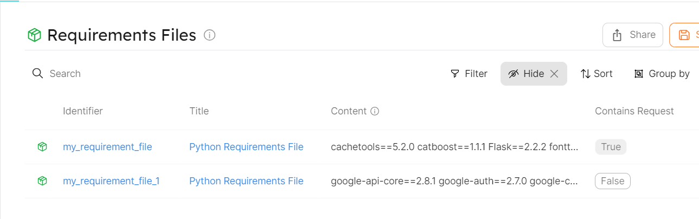

# Ingesting Requirements.txt Dependencies

## Getting started

In this example, you will create a blueprint for `package` entity that ingests all third party dependencies in your requirements.txt file using Port's REST API. You will then create a calculation property (`contains`) on this blueprint to check whether a specific package is present in the content of the file. Finally, you will add some python script to transform your requirements file.

## Package Blueprint
Create the service blueprint in Port [using this json file](./resources/blueprint.json)

### Calculation Property
The provided example in the `blueprint.json` use the `jq` mapping to check if the `content` of the blueprint entity contains the `requests` library. Please change `requests` on line 20 to match your specification.

## Variables
The list of the required variables to run this script are:
- `PORT_CLIENT_ID`
- `PORT_CLIENT_SECRET`
- `PATH_TO_REQUIREMENTS_TXT_FILE`

### Package Entity Created

